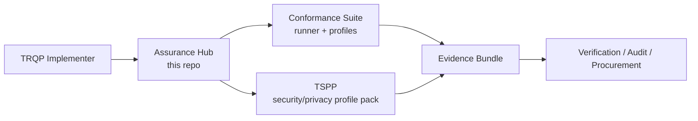

# TRQP Assurance Hub

A pragmatic, adopter-first landing zone that makes the TRQP ecosystem feel like **one product** while keeping core components decoupled for independent iteration.

## Quick links

- **Conformance runner & profiles:** [trqp-conformance-suite](https://github.com/sankarshanmukhopadhyay/trqp-conformance-suite)
- **Security & privacy profile overlay:** [TRQP-TSPP](https://github.com/sankarshanmukhopadhyay/TRQP-TSPP)
- **Combined workflow:** [Combined assurance guide](docs/guides/combined-assurance.md)
- **Cross-repo compatibility:** [Compatibility policy](docs/policies/compatibility.md)
- **Where to file issues:** [Issue routing policy](docs/policies/issue-routing.md)

## What this is

This repository is the **front door** for TRQP implementation and assurance work. It exists to reduce “where do I start?” friction and to keep cross-repo decisions (compatibility, onboarding, and workflow) in one place.

## The operating model

Think in layers:

- **Runner / Engine (platform):** runs tests, produces evidence, enforces result format
- **Profile Packs (products):** define requirements, mappings, and test plans

## Choose your path

| You are trying to… | Start here | Outcome |
|---|---|---|
| Implement TRQP endpoints and prove protocol conformance | **Conformance Suite** | Test results + evidence bundles |
| Add security & privacy posture checks (AL1/AL2) | **TRQP-TSPP** | AL1/AL2 checks + posture evidence |
| Ship a production registry with both | **Both** | Protocol + posture assurance |

### Decision cues

- If you need **“Does my TRQP implementation behave correctly?”** → Conformance Suite
- If you need **“Is my deployment secure enough for the threat model?”** → TSPP
- If you need **“Can I show auditors both behavior + posture?”** → Run both and merge evidence

## How the repos integrate (without merging)

### Integration contract (what must stay aligned)

We treat these as the shared contracts between repos:

1. **Requirement identifiers** (stable IDs)
2. **Evidence bundle format** (what an implementer produces)
3. **Result semantics** (pass/fail/skip, severity, rationale)
4. **Version compatibility declaration** (what versions are known-good together)

See: [Compatibility policy](docs/policies/compatibility.md)

### What stays independent

- Release cadence
- Roadmaps
- Issue trackers
- Packaging choices

## Recommended “golden path” workflows

### Workflow A: Protocol conformance only

1. Install and run the Conformance Suite
2. Pick a profile (Baseline/Enterprise/High-Assurance)
3. Produce an evidence bundle for your build artifacts

### Workflow B: Security & privacy posture only

1. Install and run TRQP-TSPP
2. Choose AL1 or AL2
3. Produce a posture evidence bundle

### Workflow C: Combined assurance (recommended for production)

1. Run Conformance Suite profile(s)
2. Run TSPP profile(s)
3. Merge evidence bundles under a single build identifier

See: [Combined assurance guide](docs/guides/combined-assurance.md)

## Alignment with upstream TRQP

This work is intended as an extension of the Trust over IP TRQP workstream:

- Upstream TRQP repo: <https://github.com/trustoverip/tswg-trust-registry-protocol/tree/main>

## License

Documentation and original content in this repo is licensed under **CC BY-SA 4.0**.

See [LICENSE](LICENSE).
