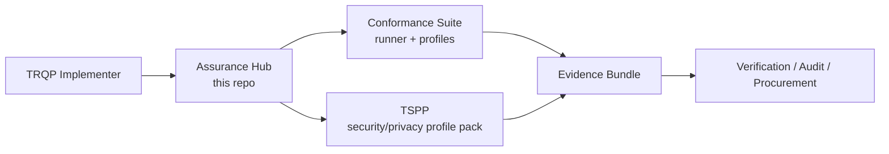
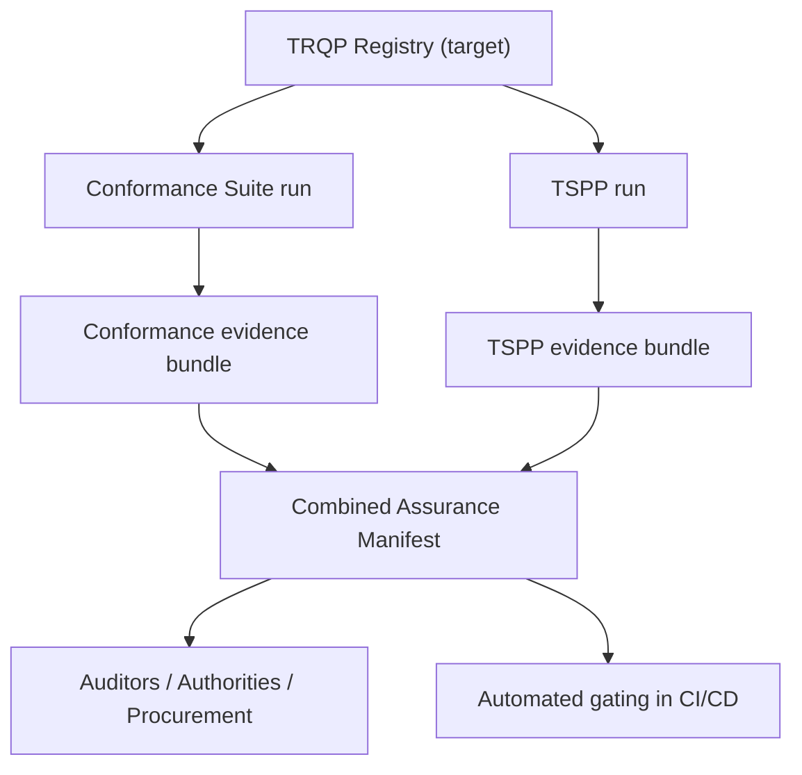

## Documentation

- Documentation governance: [`docs/governance/README.md`](docs/governance/README.md)

# TRQP Assurance Hub

📘 **Documentation site (GitHub Pages):** https://sankarshanmukhopadhyay.github.io/trqp-assurance-hub/

**Current version:** v1.1.0

**Downstream release train:** TSPP v0.7.1 · Conformance Suite v0.9.1

A pragmatic, adopter-first landing zone that makes the TRQP ecosystem feel like **one product** while keeping core components decoupled for independent iteration.

Positioning: this repository is a **candidate Assurance Profile and Governance Hardening Layer** that helps operationalize open TRQP RFEs by turning "should" discussions into **profiles, artifacts, and machine-checkable evidence**.

## Quick links

- [Run the stack](docs/guides/run-the-stack.md)
- [Operational Stack narrative](docs/architecture/operational-stack.md)
- [Trust Registry reference service](docs/guides/trust-registry-reference-service.md)
- [Machine-readable assurance profiles](docs/guides/machine-readable-assurance-profiles.md)
- [Compatibility matrix](docs/reference/compatibility-matrix.md)
- [Documentation index (role-based)](docs/index.md)
- [TSAM (Trust Systems Assurance Method)](docs/tsam/README.md)
- [Quickstart](QUICKSTART.md)
- [Operating model](#the-operating-model)
- [Combined assurance workflow](docs/guides/combined-assurance.md)
- [Ayra Trust Network crosswalk](tools/ayra-mapping.md)
- [Error states](docs/guides/error-states.md)
- [Compatibility policy and matrix](docs/policies/compatibility.md)
- [Issue routing](docs/policies/issue-routing.md)
- [Upstream TRQP RFE alignment](docs/trqp-alignment.md)
- [Assurance profile (candidate, machine-readable)](docs/guides/assurance-profile.md)
- [Assurance Levels (AL1–AL4, canonical)](docs/guides/assurance-levels.md)
- [AL contract (machine-readable)](al-contract.json)
- [Control objectives](docs/guides/control-objectives.md)
- [Recognition Assertion](docs/guides/recognition-assertion.md)
- [Lifecycle state model](docs/guides/lifecycle-state.md)
- [Recognition graph semantics](docs/guides/recognition-graph.md)
- [Revocation semantics](docs/guides/revocation-semantics.md)
- [Candidate certification baseline (CTR-ACB)](docs/certification-baseline/README.md)
- [Glossary](docs/glossary.md)

## Methodological Context

This repository implements components of the **Trust Systems Assurance Method (TSAM)** — a structured, **registry-agnostic** methodology for assurance and conformance in trust-bearing distributed systems.

TSAM binds governance semantics, assurance levels, conformance verification, runtime integrity controls, and evidence production into a coherent architecture.

See: [`docs/tsam/`](docs/tsam/README.md)
See also: [`docs/strategy/TRACE-TSAM-relationship.md`](docs/strategy/TRACE-TSAM-relationship.md)

## Assurance Levels

This repo is the **canonical source of truth** for TRQP Assurance Level definitions **AL1–AL4**.

- Canonical definitions: `docs/guides/assurance-levels.md`
- Machine-readable contract: `al-contract.json` (includes a SHA-256 hash of the canonical AL doc for pinning)

Downstream repositories (e.g., TSPP, Conformance Suite) **MUST** reference these definitions and **MUST NOT** redefine AL semantics locally.

- Producer repos:
  - Conformance Suite (CTS): https://github.com/sankarshanmukhopadhyay/trqp-conformance-suite (crosswalk: `docs/hub-crosswalk.md`)
  - TRQP-TSPP: https://github.com/sankarshanmukhopadhyay/TRQP-TSPP (crosswalk: `docs/hub-crosswalk.md`)

## Ayra Trust Network

This repository includes an end-to-end crosswalk mapping the five Hub controls to
[Ayra Trust Network](https://ayra.forum) conformance tiers. Ayra operators can use
this as a pre-submission checklist before engaging the Ayra conformance process.

- Crosswalk and submission checklists: [`tools/ayra-mapping.md`](tools/ayra-mapping.md)
- Ayra TRQP Profile: https://ayraforum.github.io/ayra-trust-registry-resources/
- CTS Ayra profile: `profiles/ayra_baseline.yaml` (in `trqp-conformance-suite`)
- TSPP Ayra profile: `docs/profiles/ayra-baseline.md` (in `TRQP-TSPP`)

Key points for Ayra operators:

- `did:webvh` is required for all ecosystem, trust registry, and cluster identifiers
- JWS response signing is required at every Ayra tier — not an AL2-only upgrade
- Both `/authorization` and `/recognition` endpoints are required by Ayra (TRQP core requires only one)

## What this is

This repository is the **front door** for TRQP implementation and assurance work across:

- **Core conformance runner and profiles:** [`trqp-conformance-suite`](https://github.com/sankarshanmukhopadhyay/trqp-conformance-suite)
- **Security and privacy profile overlay:** [`TRQP-TSPP`](https://github.com/sankarshanmukhopadhyay/TRQP-TSPP)

It provides:

- A single onboarding narrative (choose-your-path)
- A shared terminology map (runner vs profile packs)
- Cross-repo compatibility expectations
- A lightweight governance and issue routing model
- Minimal schemas to bind conformance and posture evidence together
- A candidate assurance profile format for publishing posture and governance expectations

To keep the repo trustworthy, CI validates that JSON examples match their JSON Schemas.

## Certification baseline

This repo includes a **Candidate Trust Registry Assurance & Certification Baseline (CTR-ACB)**: a transport-neutral, implementation-neutral baseline for certifiable controls, evaluation procedures, and machine-readable certification attestations. See `docs/certification-baseline/`.

## Choose your path

| You are trying to… | Start here | Outcome |
|---|---|---|
| Implement TRQP endpoints and prove protocol conformance | **Conformance Suite** | Test results + evidence bundles |
| Add security and privacy posture checks (AL1/AL2) | **TRQP-TSPP** | AL checks + posture evidence |
| Ship a production registry with both | **Both** | Protocol + posture assurance |
| Join the Ayra Trust Network | **Both + Ayra crosswalk** | Pre-certification evidence package |

### Decision guide

- If you need **"Does my TRQP implementation behave correctly?"** → Conformance Suite
- If you need **"Is my deployment secure enough for the threat model?"** → TRQP-TSPP
- If you need **"Can I show auditors both behavior and posture?"** → Use both
- If you need **"Am I ready for Ayra conformance submission?"** → Use both + `tools/ayra-mapping.md`

## The operating model

Think in layers:

- **Runner / Engine (platform):** runs tests, produces evidence, enforces result format
- **Profile Packs (products):** define requirements, mappings, and test plans

## Evidence flow

For machine-readable provenance across both runs, see the schema at:
- `schemas/combined-assurance-manifest.schema.json`

For the narrative layer and discovery surface, see:
- `docs/architecture/operational-stack.md`
- `services/trust-registry-reference/`
- `profiles/al1-basic.yaml` through `profiles/al4-regulated.yaml`

## How the repos integrate (without merging)

### Integration contract

We treat these as shared contracts between repos:

1. **Requirement identifiers** (stable IDs)
2. **Evidence bundle shape** (what an implementer produces)
3. **Result semantics** (pass/fail/skip + severity + rationale)
4. **Version compatibility declaration** (known-good combinations)

See:
- [Compatibility policy and matrix](docs/policies/compatibility.md)

### What stays independent

- Release cadence
- Roadmaps
- Issue trackers
- Packaging choices

## Golden path workflows

### Workflow A: Protocol conformance only

1. Install and run the Conformance Suite
2. Pick a profile (Baseline / Enterprise / High-Assurance)
3. Produce an evidence bundle for your build artifacts

### Workflow B: Security and privacy posture only

1. Install and run TRQP-TSPP
2. Choose AL1 or AL2
3. Produce posture evidence artifacts

### Workflow C: Combined assurance (recommended)

1. Run a Conformance Suite profile
2. Run a TSPP profile
3. Bind both runs under a single build identifier using a Combined Assurance Manifest

See:
- [Combined assurance workflow](docs/guides/combined-assurance.md)

### Workflow D: Ayra Trust Network submission

1. Run CTS `ayra_baseline` profile
2. Run TSPP with AL2 (JWS required at all Ayra tiers) and recognition security tests
3. Generate combined assurance manifest
4. Verify checklist in `tools/ayra-mapping.md` for your target tier (Basic / Cross-Ecosystem / Sovereign)

## Issue routing

- If the issue is about **test runner behavior, evidence output, CI, profiles in-suite** → file in `trqp-conformance-suite`
- If the issue is about **security/privacy requirements, AL levels, posture checks** → file in `TRQP-TSPP`
- If the issue is about **cross-repo compatibility, documentation, onboarding** → file here

See:
- [Issue routing policy](docs/policies/issue-routing.md)

## Alignment with upstream TRQP

This work is intended as an extension of the Trust over IP TRQP workstream:

- [ToIP TRQP upstream repository](https://github.com/trustoverip/tswg-trust-registry-protocol/tree/main)

For how this repo maps to current upstream RFEs (and what it explicitly does *not* try to solve), see:

- [Upstream TRQP RFE alignment](docs/trqp-alignment.md)

## License

Documentation and original content in this repo are licensed under **CC BY-SA 4.0**.

See: [LICENSE](LICENSE)

## GRID readiness

This repository includes a minimal **GRID readiness kernel** to demonstrate how TRQP can be extended to support multiple trust registry/directory implementations.

- Profile: `profiles/grid-profile.md`
- Schemas: `schemas/registrar.schema.json`, `schemas/grid-status-feed.schema.json`
- Verifier workflow: `docs/how-to-verify-grid.md`
- Crosswalk: `docs/grid-gtr-crosswalk.md`

External references:
- UN/CEFACT GTR / GRID: https://un.opensource.unicc.org/unece/uncefact/gtr/
- EBSI Trusted Issuers Registry / Trusted Entity Registry APIs: https://hub.ebsi.eu/apis/pilot/trusted-issuers-registry

## UNTP Digital Identity Anchor (DIA)

Some authoritative directories use UNTP DIA (and Identity Resolver patterns) to anchor issuer identities. This repo supports DIA-aware directory assurance via the SAD-1 `identity_anchor` extension and vendors the DIA JSON-LD context for reproducible checks. See `docs/reference/untp-digital-identity-anchor.md`.

## Experimental profiles

- **DeDi (Decentralized Directory Protocol)**: `profiles/dedi-experimental-profile.*` (experimental mapping for decentralized directories)

### DeDi experimental spine

- Mapping matrix: `docs/reference/dedi-mapping-matrix.md`
- Machine-readable matrix: `docs/reference/dedi-mapping-matrix.yaml`
