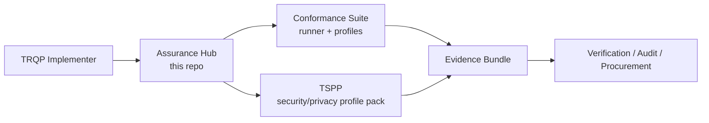

# TRQP Assurance Hub

A pragmatic, adopter-first landing zone that makes the TRQP ecosystem feel like **one product** while keeping core components decoupled for independent iteration.

## Quick links

- [Quickstart](QUICKSTART.md)
- [Operating model](#the-operating-model)
- [Combined assurance workflow](docs/guides/combined-assurance.md)
- [Evidence artifacts and expectations](docs/guides/evidence-artifacts.md)
- [Error states](docs/guides/error-states.md)
- [Compatibility policy + matrix](docs/policies/compatibility.md)
- [Issue routing](docs/policies/issue-routing.md)
- [Glossary](docs/glossary.md)

## What this is

This repository is the **front door** for TRQP implementation and assurance work:

- **Core conformance runner & profiles**: `trqp-conformance-suite`  
  <https://github.com/sankarshanmukhopadhyay/trqp-conformance-suite>
- **Security & privacy profile overlay (TSPP)**: `TRQP-TSPP`  
  <https://github.com/sankarshanmukhopadhyay/TRQP-TSPP>

It provides:

- A single onboarding narrative (choose-your-path)
- A shared terminology map (runner vs profile packs)
- Cross-repo compatibility expectations
- A lightweight governance + issue routing model

## Choose your path (start in 60 seconds)

| You are trying to… | Start here | Outcome |
|---|---|---|
| Implement TRQP endpoints and prove protocol conformance | **Conformance Suite** | Test results + evidence bundles |
| Add security & privacy posture checks (AL1/AL2) | **TRQP-TSPP** | AL1/AL2 checks + posture evidence |
| Ship a production registry with both | **Both** | Protocol + posture assurance |

### Quick decision tree

- If you need **“Does my TRQP implementation behave correctly?”** → Conformance Suite
- If you need **“Is my deployment secure enough for the threat model?”** → TSPP
- If you need **“Can I show auditors both behavior + posture?”** → Use both

## The operating model

Think in layers:

- **Runner / Engine (platform):** runs tests, produces evidence, enforces result format
- **Profile Packs (products):** define requirements, mappings, and test plans

## How the repos integrate (without merging)

### Integration contract (what must stay aligned)

We treat these as the **shared contracts** between repos:

1. **Requirement identifiers** (stable IDs)
2. **Evidence bundle format** (what an implementer produces)
3. **Result semantics** (pass/fail/skip, severity, rationale)
4. **Version compatibility declaration** (what versions of each tool are known-good together)

See: [`docs/policies/compatibility.md`](docs/policies/compatibility.md)

### What stays independent

- Release cadence
- Roadmaps
- Issue trackers
- Packaging choices

## Recommended “golden path” workflows

### Workflow A: Protocol conformance only

1. Install and run the Conformance Suite
2. Pick a profile (Baseline/Enterprise/High-Assurance)
3. Produce evidence bundle for your build artefacts

### Workflow B: Security & privacy posture only

1. Install and run TRQP-TSPP
2. Choose AL1 or AL2
3. Produce posture evidence bundle

### Workflow C: Combined assurance (recommended for production)

1. Run Conformance Suite profile
2. Run TSPP profile
3. Merge evidence bundles under a single build identifier

See: [`docs/guides/combined-assurance.md`](docs/guides/combined-assurance.md)

For machine-readable provenance across both runs, use the **Combined Assurance Manifest** schema: `schemas/combined-assurance-manifest.schema.json`.

## Issue routing (reduce contributor thrash)

- If the issue is about **test runner behavior, evidence output, CI, profiles in-suite** → file in `trqp-conformance-suite`
- If the issue is about **security/privacy requirements, AL1/AL2, posture checks** → file in `TRQP-TSPP`
- If the issue is about **cross-repo compatibility, documentation, onboarding** → file here

See: [`docs/policies/issue-routing.md`](docs/policies/issue-routing.md)

## Alignment with upstream TRQP

This work is intended as an extension of the Trust over IP TRQP workstream:

- Upstream: <https://github.com/trustoverip/tswg-trust-registry-protocol/tree/main>

## License

- Documentation and original content in this repo: **CC BY-SA 4.0**

See [`LICENSE`](LICENSE).
