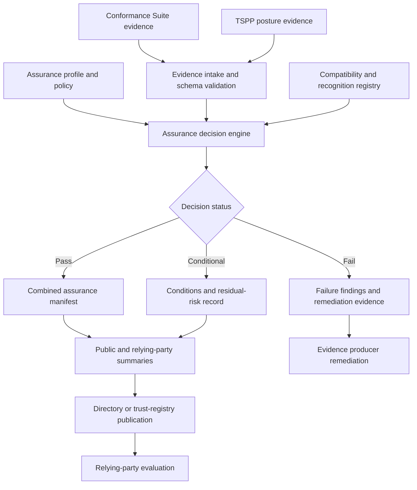

# Combined assurance composition and publication

The hub coordinates evidence from the other two repositories, but its core composition, policy-decision, conditional-assurance, and publication paths were not shown in one place. This diagram establishes those boundaries and makes non-pass outcomes auditable.

## Assurance interpretation

The diagram is normative only where it links to an identified specification, schema, profile, or executable test. Each transition should produce inspectable evidence: selected profile identifiers, test inputs, result artifacts, decision records, and publication manifests. Revocation or supersession must be represented by lifecycle data rather than by silently replacing prior evidence.
